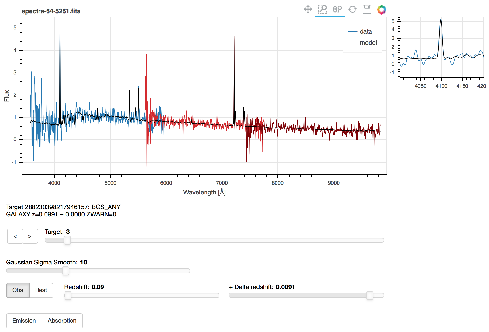

========
prospect
========

Digging into DESI spectra, looking for stuff.
---------------------------------------------

|Actions Status| |Coveralls Status| |Documentation Status|

Prospect provides a tool to visually inspect DESI spectra, especially in order to
carry out coordinated visual inspection campaigns of specific datasets.

The software can be used within Jupyter notebooks, or can be used as a standalone code
to create (standalone) HTML pages.

.. |Actions Status| image:: https://github.com/desihub/prospect/workflows/CI/badge.svg
    :target: https://github.com/desihub/prospect/actions
    :alt: GitHub Actions CI Status

.. |Coveralls Status| image:: https://coveralls.io/repos/desihub/prospect/badge.svg?branch=main
    :target: https://coveralls.io/github/desihub/prospect?branch=main
    :alt: Test Coverage Status

.. |Documentation Status| image:: https://readthedocs.org/projects/desi-prospect/badge/?version=latest
    :target: http://desi-prospect.readthedocs.org/en/latest/
    :alt: Documentation Status

What it does
~~~~~~~~~~~~

* Provides an interactive spectral viewer for DESI data at NERSC without
  needing to download or install anything locally.
* All DESI spectra can be displayed, eg. individual exposures, coadds, etc.
* Interative zoom and pan
* User-defined smoothing
* Shows noise estimated for each spectrum.
* Mouse over a region of the spectrum to get a real-time zoom in a sub-window;
  this is handy for inspecting narrow emission lines without zooming in and out
  on each one.
* Highlight common emission / absorption lines.
* Restframe wavelengths
* Shows redrock results including the redshift, ZWARN flags, and the
  best fit model.
* User-defined redshift
* Show redrock's Nth best fit in addition to the best fit model.
* Shows TARGETID and targeting bits from DESI_TARGET, MWS_TARGET,
  and BGS_TARGET, and more target info like mags and shapes.
* Display imaging of target.
* Buttons for saving visual inspection results before moving to next target.

What it doesn't do (yet)
~~~~~~~~~~~~~~~~~~~~~~~~

Any of these could be added later but don't yet exist.
If you really want a feature, please consider contributing it.

* Show masks
* Displaying model of 2D sky-subtracted raw data

Examples
~~~~~~~~

Usage within Jupyter notebooks: see example notebooks in `doc/nb`.

Creating standalone HTML pages: see example scripts in `bin/example_prospect_pages.sh`

-----

:Eric Armengaud: Saclay - CEA
:Stephen Bailey: Lawrence Berkeley National Lab
:Benjamin Weaver: NSF NOIRLab
